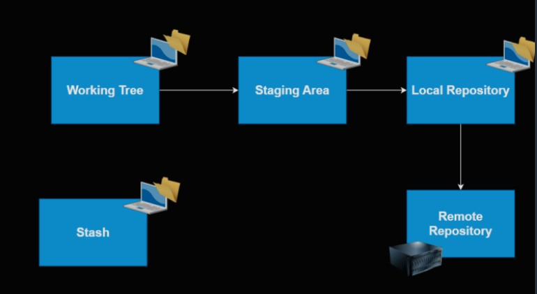
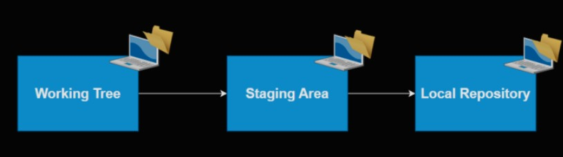
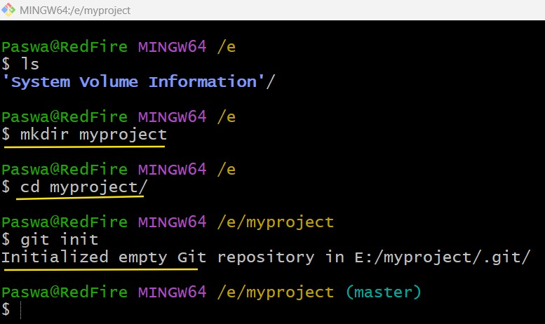
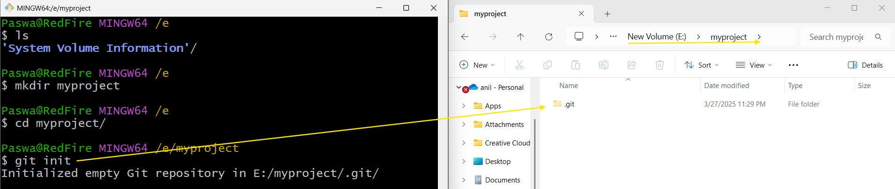

# Git

* Git has five stages, initially we will be focusing on three areas



* This image illustrates the workflow and components of a Git version control system. Let me explain each part:

1. Working Tree: This is where you actively work on your files. It's your project directory where you make changes to your code.

2. Working Tree: This is where you actively work on your files. It's your project directory where you make changes to your code.

3. Staging Area: Also known as the "index," this is where you prepare commits. Files moved here are ready to be committed to the repository.

4. Local Repository: This is where Git stores the history of your project on your local machine. It contains all the commits you've made.

5. Stash: This is a temporary storage area where you can save changes that you're not ready to commit. It's useful when you need to switch branches but don't want to commit incomplete work.

The arrows in the diagram show the typical flow of changes:

   * From Working Tree to Staging Area (when you stage changes)
   * From Staging Area to Local Repository (when you commit)
   * From Local Repository to Remote Repository (when you push)

* This setup allows for a flexible workflow where you can prepare and review changes before committing them, and then share those changes with others by pushing to a remote repository.

# Git Basic Configuration

* Git configuration is essential for setting up your identity and customizing how Git behaves. Here are the key configuration steps:
  * Setting Your Identity
  * The first and most important configuration is to set your identity:

```
git config --global user.name "Your Name"
git config --global user.email "yourname@example.com"
```
* This information is included in every commit you make. It's important because it helps identify who made specific changes in collaborative projects.

# Configuration Levels

* Git uses three configuration levels, each overriding the previous one:

1. System level (--system): Applies to every user on the system and all repositories
      * Stored in [path]/etc/gitconfig

2. Global level (--global): User-specific configuration
      * Stored in ~/.gitconfig or ~/.config/git/config
      * Applies to all your repositories

3. Local level (--local, default): Repository-specific
      * Stored in .git/config within the repository

* Useful Configuration Settings
  * Beyond identity, here are other helpful configurations:

```
# Set default branch name to main
git config --global init.defaultBranch main

# Configure merge behavior
git config --global pull.rebase false

# Enable colored output
git config --global color.ui auto

# Display original state in conflicts
git config --global merge.conflictstyle diff3

```
# Configuring Code Editors

* You can set your preferred code editor for Git operations:
```
# For VSCode
git config --global core.editor "code --wait"

# For Sublime Text
git config --global core.editor "'C:/Program Files/Sublime Text 2/sublime_text.exe' -n -w"

# For Atom
git config --global core.editor "atom --wait"

```

# Verifying Your Configuration
  * To check your current settings:

```
# List all configurations
git config --list

# Check specific settings
git config --get user.name
git config --get user.email
``` 

* These basic configurations will help you get started with Git and provide a personalized experience tailored to your workflow.



* The images show the core components of Git's architecture: Working Tree, Staging Area, and Local Repository. The first image also includes the Remote Repository and Stash area.

   * To create a local Git repository as requested:
      * Create a new directory in your system:
```
mkdir myproject
cd myproject
```

2. Initialize a Git repository:

```
git init

```

* When you run git init, Git creates a hidden .git subdirectory in your current working directory. This hidden folder contains all the necessary repository files and tracking information. You'll see a confirmation message like:

```
Initialized empty Git repository in /path/to/myproject/.git/
```



* This initializes an empty Git repository with a default branch (typically called "main" in newer Git versions). At this point, Git is set up but isn't tracking any files yet. You can verify the repository status with `git status`

* After initialization, you can configure your repository settings, add files to start tracking them, and make your first commit to begin your project's version history.

* To change the default branch name to "main" for new repositories, you can use the following Git configuration command:

```
git config --global init.defaultBranch main

```


# Our current focus areas

Working Tree
------------------
   * This is area of work for us
   * In this we make changes, add/delete files etc


Staging Area
--------------
   * This is area where the changes can be staged to be part of a commit

# Other things to know

Git Log
--------

* The git log command displays the commit history of a repository. It shows:
   * Commit SHA (unique identifier)
   * Author
   * Date
   * Commit message

* You can customize the output using various flags:
   * `git log --oneline`: Displays one commit per line with a shortened SHA and commit message.
   * `git log --stat`: Shows modified files and the number of lines added or removed
   * `git log --patch or git log -p`: Displays the actual changes made in each commit

Git Status
-----------

* The git status command shows the current state of your working directory and staging area. It provides information about:
   * Modified files that haven't been staged
   * Staged files ready for commit
   * Untracked files
* The ideal status in Git is when your working tree matches your local repository

Tracked and Untracked Files
-----------------------------

* `Tracked files`: These are files that Git is aware of and actively manages. They have been previously committed or staged.

* `Untracked files`: These are files in your working directory that Git doesn't track. They haven't been staged or committed.

   * To make an untracked file tracked, use the `git add` command:
    `git add <filename>`
* This stages the file and prepares it for commit

# Other Useful Git Commands

1. `git init`: Initializes a new Git repository

2. `git clone <repo_url>`: Clones a remote repository to your local machine

3. `git branch`: Lists all branches in your repository

4. `git checkout <branch_name>`: Switches to a different branch

5. `git commit -m "commit message"`: Commits staged changes with a descriptive message

6. `git push`: Uploads local repository content to a remote repository

7. `git pull`: Fetches and merges changes from the remote repository to your local repository


