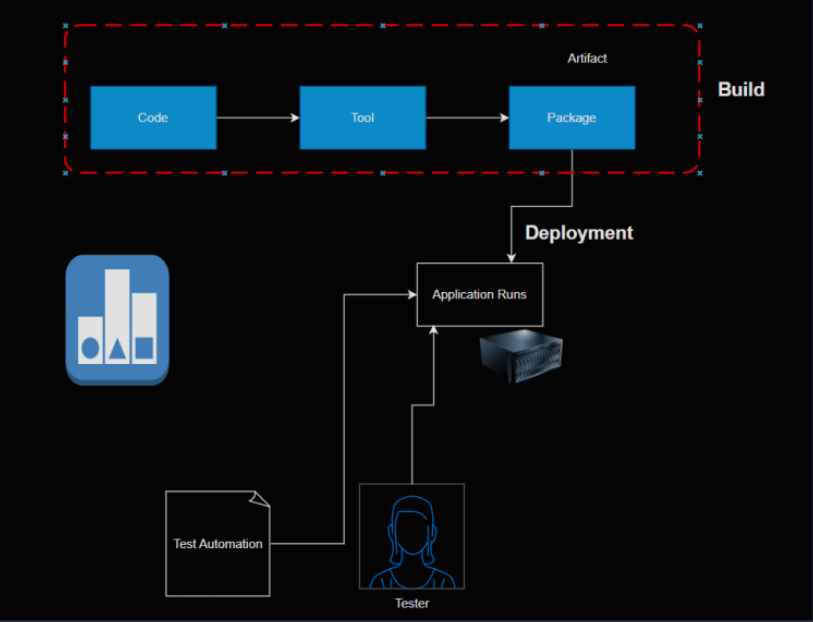

# CI/CD
18/Mar/2025 

* One of the major areas of DevOps is building and maintainting Pipelines
* CI/CD Pipelines are supposed to
    * Build package
    * Deploy Application in various environments
    * Run the Automated Tests for each environment and Generate Reports

# 1. Build Phase (Code to Artifact Creation)

   * This is the first stage of the DevOps pipeline, where the application source code is converted into a deployable package.

Code:
-----

  * Developers write code using programming languages (e.g., Java, Python, Node.js).
  * Code is stored in a version control system like Git (GitHub, GitLab, or Bitbucket).
  * Changes are committed and pushed to a repository.

Tool (Build Tool):
------------------

  * A build tool (e.g., Maven, Gradle, or npm) compiles the source code.
  * Dependencies (libraries) are downloaded.
  * The code is tested through unit tests.

Package (Artifact Creation):
------------------------------

  * After successful compilation, an artifact (e.g., .jar, .war, .zip, Docker image) is created.
  * This artifact is stored in an artifact repository (e.g., Nexus, Artifactory, AWS S3).
  * The build process ensures the application is packaged correctly and is ready for deployment.

# 2. Deployment Phase

 * Once the build is successful, the artifact is deployed to a runtime environment.
   
Deployment Process:
--------------------
   * The artifact is moved to a server, container, or cloud platform (e.g., Kubernetes, AWS EC2, Azure VM).
   * Deployment tools like Ansible, Terraform, or Kubernetes manage the release process.
   * Configuration files and environment variables are set up.

Application Runs:
------------------
   * The deployed application starts running on the server.
   * Services (like databases, APIs) interact with the application.

# 3. Testing Phase (Quality Assurance)

* After deployment, the application is tested for stability, performance, and functionality.

Test Automation:
------------------

  * Automated testing frameworks (e.g., Selenium, JUnit, TestNG) execute test cases.
  * Continuous testing ensures no major defects exist.
  * Security tests and load tests might also run.

Tester (Manual Testing):
---------------------------
  * QA testers manually verify the application.
  * Any bugs or issues are reported back to the development team.

# 4. Feedback Loop (Continuous Improvement)
  
  * If issues are found, developers fix the code and restart the process.
  * The cycle ensures Continuous Integration (CI) and Continuous Deployment (CD).

Key DevOps Tools Used in This Process
-------------------------------------

 *  __CI/CD:__ Jenkins, GitHub Actions, GitLab CI/CD

 * __Build Tools:__ Maven, Gradle, npm

 * __Configuration Management:__ Ansible, Chef, Puppet

 * __Containerization & Deployment:__ Docker, Kubernetes, Helm

 * __Testing Tools:__ Selenium, JUnit, TestNG

 * __Monitoring:__ Prometheus, Grafana, ELK Stack

* This entire process helps in automation, faster deployments, and high-quality releases in DevOps. 

Terms:
-------
 
 * Artifact: Build result is an artifact, the package is most important one to be preserved
 * Repository: A storage location which can maintain history (i.e. versions or revisions )

  

* Terms

 