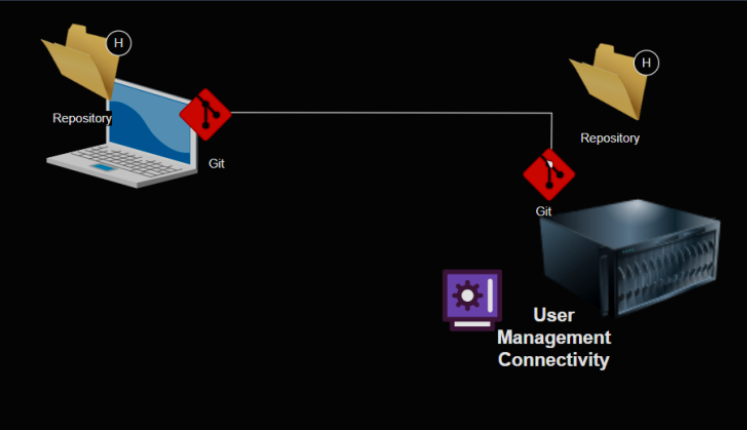

# Version Control Systems (VCS)

* This is a source code repository which stores code and also the history which represents
  * the changes done
  * who has done it
  * when it was done

* Generally Version Control Systems are designed for multi users.
* Any VCS will have repositories which developers(users) will get a copy or equivalent to copy in their local workstation
* They get or make changes from/to VCS

* The image illustrates a Version Control System (VCS) workflow with a client-server architecture. It shows how multiple developers interact with a centralized version control system.

* The diagram depicts:

    * Two developers (represented by user icons on the left) working on separate computers
    * Each developer's computer has a VCS client installed (labeled "Client (VCS)")
    * A central "Version Control System Server" that manages the repositories
    * Multiple repositories (folder icons marked with "H") stored on the server
    * Bidirectional workflow showing:
        * Developers can "Submit" changes to the server (shown by arrows pointing to the server)
        * Developers can "Get the updates" from the server (shown by arrows pointing back to clients)

* This represents a centralized version control system where developers push their changes to a shared server and pull updates from it. The server maintains the official repositories with version history, allowing team members to collaborate on the same codebase while tracking all changes.

Generations of Version Control Systems
-----------------------------------------

   * Client Server: 
    * Examples:
        * Subversion
        * TFS
        * ClearCase
        * Perforce

    * Distributed
        * Examples:
            * Mercurial
            * Git 

# Basic Design of Git
 
 * In Git every one (client, server) have repositories
 * IF you have to create a server you need to install same software as client (git) and for server features (USer management, Connectivity) you can install additional components

* The image illustrates a Git distributed version control system setup, showing:

1. Local Repository: On the left side, there's a laptop with a folder marked with "H" (representing a repository) and the Git logo, indicating a local Git repository where a developer works.

2. Remote Repository: On the right side, there's a server with another folder marked with "H" and the Git logo, representing a remote Git repository (like GitHub, GitLab, or a self-hosted Git server).

3. Bidirectional Connection: The line connecting both repositories shows that Git allows two-way synchronization - developers can push changes to the remote repository and pull updates from it.

4. User Management & Connectivity: At the bottom right, there's a control panel labeled "User Management Connectivity," which represents the authentication and access control mechanisms that manage who can access the remote repository and what actions they can perform.

* This setup demonstrates Git's distributed nature, where each developer has a complete copy of the repository on their local machine, but can synchronize with a central server for collaboration. Unlike centralized VCS, Git allows developers to work offline and commit changes locally before pushing them to the shared repository.

Problem:
---------

* I have a huge room full of books, i want to send them to new home.

# Version Control Systems (VCS) are essential tools in software development that track, manage, and store changes to code and other files over time.

Core Concepts of Version Control Systems
-----------------------------------------

* Version control, also known as source control or revision control, is the practice of tracking and managing changes to software code and related files. It creates a historical record of modifications, allowing developers to see who changed what and when, while providing the ability to revert to previous versions if needed.

Key Features
------------

* Change Tracking: Records every modification made to files, including who made the changes and when they occurred.

* History Preservation: Maintains a complete history of all changes, allowing teams to understand how code evolved over time.

* Branching and Merging: Enables developers to create separate branches to work on features or fixes independently, then merge changes back into the main codebase.

* Conflict Resolution: Identifies and helps resolve conflicts when multiple developers modify the same code. VCS identifies conflicting changes when multiple developers modify the same file. It provides tools to resolve conflicts before merging changes into the main repository.

* Rollback Capability: Allows reverting to previous versions if problems arise with current changes.

# Types of Version Control Systems

Local Version Control Systems
------------------------------

* The simplest form of version control, storing changes in a local database on the developer's machine. Examples include RCS (Revision Control System).

Centralized Version Control Systems (CVCS)
-------------------------------------------

* Uses a single central server to store all versions of files:

   * All team members check out files from and commit changes to this central repository
   * Examples include Subversion (SVN) and Team Foundation Server (TFS)
   * Provides better control and oversight for project managers

Distributed Version Control Systems (DVCS)
-------------------------------------------

* Each developer has a complete local copy of the repository:
   
    * Developers can work offline and commit changes locally
    * Changes can later be synchronized with a central repository
    * Examples include Git and Mercurial
    * Offers greater flexibility and redundancy

Lock-Based Systems
--------------------

* Uses file locking to prevent simultaneous editing:

    * When a developer works on a file, it's locked to prevent others from modifying it
    * Ensures no conflicting changes but limits collaboration

Benefits of Version Control in DevOps
---------------------------------------

* __Enhanced Collaboration__

    * VCS enables team members to work concurrently on the same project without interference, regardless of their geographic location. This promotes seamless collaboration and knowledge sharing.

* __Quality Improvement__

    * By tracking every change and facilitating code reviews, VCS helps maintain high code quality and standards. Teams can easily identify issues and ensure best practices are followed.

* __Accelerated Development__

    * With proper branching strategies, teams can work on multiple features simultaneously, significantly reducing development time and speeding up delivery.

* __Risk Reduction__

    * VCS acts as a safety net, allowing teams to experiment without fear of damaging the codebase. If something goes wrong, they can easily revert to a previous stable version.

* __Traceability and Accountability__

    * Every change is documented with author information and timestamps, creating a clear audit trail that helps in troubleshooting and understanding code evolution.

# Integration with DevOps Workflow

* In the DevOps pipeline (like the one in your previous image showing Build, Deployment, and Testing phases), VCS serves as the foundation:

    * It stores the source code that enters the Build phase

    * It enables automated testing and integration in CI/CD pipelines

    * It facilitates collaboration between development and operations teams

    * It provides version control for infrastructure as code and configuration files

